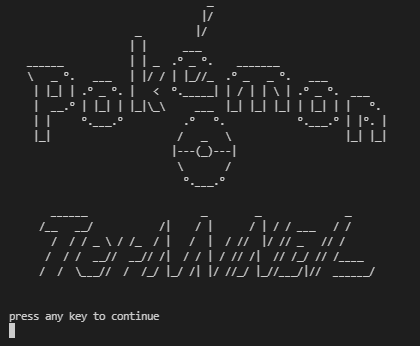
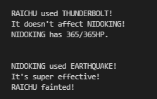

# Terminal_Pokemon (WIP)

## Terminal based Pokemon Gen 1 battle simulator. Recreating the battle experience of the Pokemon Red/Blue/Yellow games.

## Current features:

- Proper battle interactions

- Type checking for attack effectiveness

- Pokemon switching upon fainting

- All fully evolved pokemon available to use

- Multiple functioning attacks from all types

## To do:

- Fill movepools

- Add status effect interactions

- Add volatile status interactions

- Teambuilder

- Create "enemy" teams

- Create NPC attack randomizer for game accuracy

- Bug testing

- Intergration into full stack app, applying web sockets to allow players from around the world to play together as well as vs NPCs.

- Create a bot script for NPCs to make better battle decisions for higher difficulty options.
